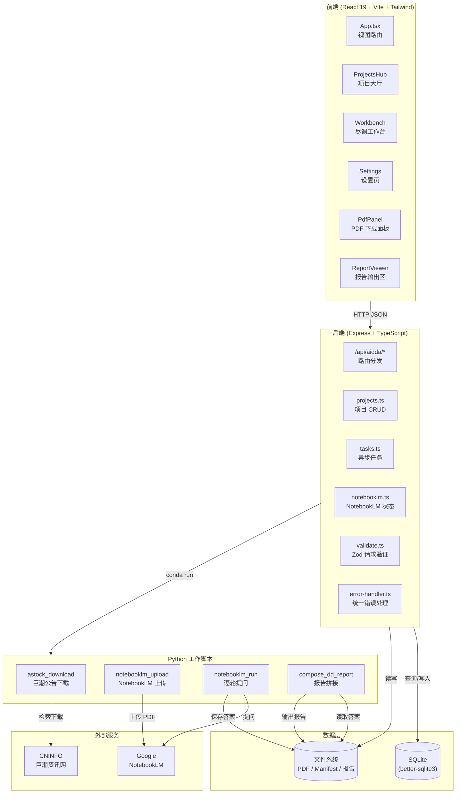

# AIDDA Workbench｜AI 驱动的自动化尽职调查工作台

> **AI-Driven Due Diligence Automation Workbench**
> 简称：**AIDDA Workbench**

AIDDA Workbench 是面向 A 股上市公司尽职调查场景的自动化工作台。第一版聚焦一条真实可运行的主链路：

```text
公告下载 → PDF 校验 → NotebookLM 上传 → 固化问题逐轮提问 → 答案保存 → 尽调报告拼接
```

<p align="center">
  
  
  
  
</p>

## 系统架构



## 30 秒快速开始

```bash
./aidda.sh install
./aidda.sh start
```

访问：

```text
http://localhost:3871
```

提交前检查：

```bash
./aidda.sh check
python3 -m py_compile scripts/*.py
```

当前版本不使用 n8n，不使用 Gemini API，不重新设计问题清单，核心依赖为：

- [`a-stock-data`](https://github.com/simonlin1212/a-stock-data)：用于 A 股上市公司公告检索与 PDF 下载；
- [`notebooklm-py`](https://github.com/teng-lin/notebooklm-py)：用于创建 / 复用 NotebookLM 笔记、上传公告 PDF、逐轮提问并保存回答。

---

## 1. 当前版本定位

当前版本为 **AIDDA Workbench 第一版 MVP**。

目标不是构建完整审批系统，也不是让 AI 一次性生成完整尽调报告，而是先跑通以下闭环：

```text
创建项目
  → 输入 A 股股票代码
  → 自动生成规范项目名称
  → 同步创建 / 复用 NotebookLM 笔记
  → 进入尽调详情工作台
  → 打开巨潮公告 PDF 入口
  → 下载近三年定期报告
  → 下载成功一个 PDF 即上传到对应 NotebookLM 笔记
  → 下载最近 200 个公告
  → 下载成功一个 PDF 即上传到对应 NotebookLM 笔记
  → 合并去重
  → 校验 PDF
  → 生成 manifest
  → 用户点击生成报告
  → 按既有问题清单逐轮向 NotebookLM 提问
  → 保存每轮答案
  → 按尽调报告框架拼接 Markdown 报告
  → 保留公告无法填列的空项
  → 输出未能填列事项和需补充资料
```

第一版现在以 **前端项目管理中心 + 尽调详情工作台** 作为主入口。CLI 仍保留为调试、验收和批处理入口。

---

## 2. 系统边界

### 2.1 第一版已实现

- A 股股票代码输入；
- 巨潮公告检索；
- 近三年定期报告下载；
- 最近公告下载；
- 公告 PDF 校验；
- manifest 记录；
- NotebookLM 创建或复用；
- PDF 上传 NotebookLM；
- NotebookLM source 状态等待；
- 固化问题清单逐轮提问；
- 每轮答案独立保存；
- Markdown 尽调报告拼接；
- 公告未披露内容保留占位符；
- CLI 全流程编排；
- Express 中新增 AIDDA API 端点；
- 前端新增项目管理中心与尽调详情工作台闭环入口。

### 2.2 第一版明确不做

- 不使用 n8n；
- 不使用 Gemini API；
- 不调用 OpenAI、Gemini 或其他通用大模型 API；
- 不重新优化问题清单；
- 不做全市场批量；
- 不做多股票并发；
- 不做复杂权限系统；
- 不做复杂数据库建模；
- 不做自动审批结论；
- 不用 mock 数据替代真实公告下载和真实 NotebookLM 上传。

---

## 3. 系统主流程

```text
┌────────────────────┐
│  创建尽调项目        │
└─────────┬──────────┘
          │
          ▼
┌────────────────────┐
│  输入 A 股股票代码    │
└─────────┬──────────┘
          │
          ▼
┌────────────────────┐
│  下载公告 PDF        │
│  - 近三年定期报告     │
│  - 最近 200 个公告    │
└─────────┬──────────┘
          │
          ▼
┌────────────────────┐
│  PDF 校验与去重       │
│  - 公告 ID           │
│  - PDF URL           │
│  - sha256            │
└─────────┬──────────┘
          │
          ▼
┌────────────────────┐
│  生成 manifest       │
│  JSONL 状态记录       │
└─────────┬──────────┘
          │
          ▼
┌────────────────────┐
│  上传 NotebookLM     │
│  notebooklm-py       │
└─────────┬──────────┘
          │
          ▼
┌────────────────────┐
│  逐轮提问            │
│  question_rounds.json│
└─────────┬──────────┘
          │
          ▼
┌────────────────────┐
│  保存每轮答案         │
│  round_0.md ...      │
└─────────┬──────────┘
          │
          ▼
┌────────────────────┐
│  拼接尽调报告         │
│  Markdown 输出        │
└────────────────────┘
```

---

## 4. 技术栈

| 层级            | 技术                                            | 说明                                          |
| --------------- | ----------------------------------------------- | --------------------------------------------- |
| 前端            | React 19 + TypeScript + Vite 6 + Tailwind CSS 4 | 项目管理中心、尽调详情工作台、设置中心        |
| 后端            | Express 4 + TypeScript                          | 模块化 API 层，通过安全子进程调用 Python 脚本 |
| 数据库          | SQLite + better-sqlite3                         | 持久化项目、任务和产物索引                    |
| 公告下载        | a-stock-data / 巨潮公告逻辑                     | 检索并下载上市公司公告 PDF                    |
| NotebookLM      | notebooklm-py 0.7.2                             | 创建笔记、上传 PDF、逐轮提问                  |
| Python 运行环境 | conda `openclaw`                                | 执行公告下载、上传、提问、报告拼接            |
| 文件存储        | 本地文件系统                                    | manifest、PDF、答案、报告文件                 |
| 报告输出        | Markdown                                        | 第一版暂不生成 Word                           |

---

## 5. 核心功能

### 5.1 两层公告资料池

系统默认下载两类资料，并合并去重后上传 NotebookLM。

| 资料池         | 范围                                                           | 说明                                                             |
| -------------- | -------------------------------------------------------------- | ---------------------------------------------------------------- |
| 近三年定期报告 | 年报、半年报、季报、审计报告、内控评价报告、募集资金专项报告等 | 独立检索，不能依赖最近公告是否覆盖                               |
| 最近公告       | 最近 N 个公告，默认 200 个                                     | 不限公告类型，用于补充重大事项、担保、融资、诉讼、关联交易等信息 |
| 最终集合       | 近三年定期报告 + 最近公告 - 重复 PDF                           | 上传至 NotebookLM 的最终资料集                                   |

去重优先级：

```text
公告 ID → PDF URL → sha256
```

每条公告会记录来源层级：

```text
periodic_report_3y
recent_200
both
```

设置中心可维护公告标题过滤词。下载任务会把命中过滤词的公告写入 manifest，状态为
`skipped_filter`，用于过滤“开会通知”“会议通知”等不需要进入 NotebookLM 的公告。

---

### 5.2 PDF 下载与校验

每个 PDF 下载后进行基础校验：

- HTTP 状态码；
- 文件头是否为 `%PDF`；
- 文件大小是否异常；
- sha256；
- 是否重复文件。

失败不会直接中断整个项目，而是写入 manifest 并继续处理下一份公告。

尽调详情工作台会读取 manifest 并展示：

- 一张“公告资料关系矩阵”；
- 每条目标公告所属资料池；
- 目标 PDF 文件名、公告日期和巨潮链接；
- 本地下载状态与本地 PDF 路径；
- NotebookLM 附件状态、source 标题和 source_id；
- 每条公告的过滤/失败原因与可续传依据。

如果下载或上传中断，可在同一项目内再次点击下载按钮。系统会基于 manifest、已下载 PDF 和
去重信息继续处理，已成功上传的附件会保留在对应 NotebookLM 笔记中。

---

### 5.3 NotebookLM 上传

通过 `notebooklm-py` 完成：

- 检查 NotebookLM 登录状态；
- 创建新的 NotebookLM 笔记；
- 或复用已有 NotebookLM 笔记；
- 上传公告 PDF；
- 上传前查询当前 NotebookLM 笔记中已有附件；
- 若文件名 / 公告标题已匹配到已有 source，则跳过重复上传并复用 source_id；
- 等待 source 处理完成；
- 保存 notebook_id、source_id、上传状态和处理状态。

Notebook 标题建议格式：

```text
AIDDA-{股票代码}-{公司简称}-近三年定期报告+最近公告
```

如果 NotebookLM 未登录或登录失效，需先执行：

```bash
conda activate openclaw
notebooklm login
notebooklm auth check --test
```

---

### 5.4 十轮固化问题清单

第一版不重新设计问题清单，直接使用：

```text
templates/question_rounds.json
```

当前问题清单为 10 轮：

| 轮次 | 模块                     | 重点                                 |
| ---: | ------------------------ | ------------------------------------ |
|    0 | 资料目录与可填列范围识别 | 公告清单盘点、报告章节可填列性判断   |
|    1 | 商业模式与大客户分析     | 核心模式、主营构成、客户集中度       |
|    2 | 核心财务指标诊断         | 营收、利润、现金流、资产负债率、商誉 |
|    3 | 合规与司法风险排查       | 诉讼、行政处罚、股权质押、关联交易   |
|    4 | 股权结构与实际控制人     | 实控人、前十大股东、股东户数         |
|    5 | 募集资金与募投项目       | 募集资金使用、募投项目进展           |
|    6 | 行业与竞争格局分析       | 行业环境、竞争壁垒、市场地位         |
|    7 | 关联交易与独立性分析     | 关联方、交易公允性、资金占用         |
|    8 | 董监高与公司治理         | 董事会、内部控制、分红记录           |
|    9 | 尽调综合结论与风险提示   | 积极因素、风险因素、补充资料清单     |

每轮回答单独保存，便于复核和重跑。

---

### 5.5 报告拼接

报告框架来自：

```text
templates/dd_report_outline.md
```

报告拼接原则：

1. 不删除空章节；
2. 不把公告未披露内容自行补全；
3. 对无法由公告填列的内容保留占位符；
4. 将每轮 NotebookLM 回答按章节插入；
5. 报告末尾追加附录。

统一占位符：

```text
[公告资料未披露]
[仅凭公告资料无法核实，需补充尽调资料]
[需现场核查]
[需企业提供补充材料]
```

报告末尾自动追加：

- 公告引用清单；
- 未能填列事项清单；
- 需补充资料清单；
- NotebookLM 提问记录；
- PDF 附件清单。

---

## 6. 目录结构

```text
ai-dd/
├── scripts/
│   ├── __init__.py
│   ├── astock_utils.py
│   ├── astock_download_announcements.py
│   ├── notebooklm_upload.py
│   ├── notebooklm_run_questions.py
│   ├── compose_dd_report.py
│   └── run_aidda_project.py
│
├── templates/
│   ├── question_rounds.json
│   └── dd_report_outline.md
│
├── data/
│   ├── projects/
│   ├── pdfs/
│   ├── manifests/
│   ├── notebooklm/
│   ├── answers/
│   └── reports/
│
├── src/
│   ├── App.tsx
│   ├── types.ts
│   ├── data/
│   │   └── samples.ts
│   └── components/
│       └── MarkdownRenderer.tsx
│
├── server/
│   ├── db.ts
│   ├── python.ts
│   └── routes/
│       └── aidda.ts
│
├── server.ts
├── package.json
└── README.md
```

### 6.1 核心脚本说明

| 文件                                       | 作用                                                         |
| ------------------------------------------ | ------------------------------------------------------------ |
| `scripts/astock_utils.py`                  | 股票代码标准化、orgId 映射、公告检索、PDF 下载校验等工具函数 |
| `scripts/astock_download_announcements.py` | 两层公告资料池下载、合并与去重                               |
| `scripts/notebooklm_upload.py`             | NotebookLM 登录检查、创建 / 复用笔记、上传 PDF               |
| `scripts/notebooklm_run_questions.py`      | 加载问题清单、逐轮提问、保存答案                             |
| `scripts/compose_dd_report.py`             | 根据报告框架拼接 Markdown 报告                               |
| `scripts/run_aidda_project.py`             | CLI 主流程入口                                               |

### 6.2 后端工程化模块

| 文件                     | 作用                                                                     |
| ------------------------ | ------------------------------------------------------------------------ |
| `server.ts`              | Express 应用启动入口、健康检查、Vite/静态资源挂载                        |
| `server/config.ts`       | 统一读取 `.env`、端口、数据目录、SQLite 路径、conda 环境和 Python 缓冲区 |
| `server/db.ts`           | SQLite 初始化、schema、项目与任务记录读写                                |
| `server/python.ts`       | 通过 `execFile` 安全调用 Python 脚本，避免 shell 拼接                    |
| `server/routes/aidda.ts` | AIDDA 项目、下载上传、NotebookLM 状态、报告生成 API                      |

### 6.3 前端工程化模块

| 文件               | 作用                                                            |
| ------------------ | --------------------------------------------------------------- |
| `src/App.tsx`      | 项目管理中心、尽调详情工作台、设置中心的主界面                  |
| `src/api/aidda.ts` | 前端统一 API client，封装 `/api/aidda/*` 调用和后端项目数据转换 |
| `src/types.ts`     | 前端项目、文件、问题、报告等共享类型                            |

SQLite 数据库默认路径：

```text
data/aidda.sqlite
```

可通过环境变量覆盖：

```bash
AIDDA_DATA_DIR=data
AIDDA_DB_PATH=/path/to/aidda.sqlite
AIDDA_CONDA_ENV=openclaw
AIDDA_PYTHON_MAX_BUFFER_MB=50
PORT=3871
```

---

## 7. 运行指南

### 7.1 前置条件

#### 1. Python / conda 环境

当前项目默认使用 conda 环境：

```text
openclaw
```

确认环境可用：

```bash
conda activate openclaw
python --version
```

#### 2. NotebookLM 登录

```bash
conda activate openclaw
notebooklm login
notebooklm auth check --test
```

如登录成功，再执行主流程。

#### 3. Node.js 依赖

如需运行前端和 Express 后端：

```bash
npm install
```

---

### 7.2 CLI 全流程运行

推荐优先使用 CLI 验证主链路。

```bash
conda run -n openclaw python3 scripts/run_aidda_project.py \
  --project-name "宁德时代公告尽调" \
  --stock-code 300750.SZ \
  --periodic-years 3 \
  --recent-limit 200 \
  --notebook-mode create \
  --wait-ready
```

---

### 7.3 小样本验收运行

第一次运行建议不要直接上传 200 个公告，可先使用小样本验证流程：

```bash
conda run -n openclaw python3 scripts/run_aidda_project.py \
  --project-name "验收测试-宁德时代-小样本" \
  --stock-code 300750.SZ \
  --periodic-years 1 \
  --recent-limit 5 \
  --notebook-mode create \
  --wait-ready
```

---

### 7.4 复用已有 NotebookLM 笔记

```bash
conda run -n openclaw python3 scripts/run_aidda_project.py \
  --project-name "宁德时代公告尽调" \
  --stock-code 300750.SZ \
  --periodic-years 3 \
  --recent-limit 200 \
  --notebook-mode reuse \
  --notebook-id "你的NotebookLM笔记ID" \
  --wait-ready
```

---

### 7.5 跳过部分步骤

```bash
# 仅下载公告，不上传、不提问、不生成报告
conda run -n openclaw python3 scripts/run_aidda_project.py \
  --project-name "宁德时代公告尽调" \
  --stock-code 300750.SZ \
  --skip-upload \
  --skip-questions \
  --skip-report

# 跳过下载，复用已有 manifest，继续上传、提问和报告拼接
conda run -n openclaw python3 scripts/run_aidda_project.py \
  --project-name "宁德时代公告尽调" \
  --stock-code 300750.SZ \
  --skip-download \
  --notebook-mode create \
  --wait-ready

# 跳过下载和上传，复用已有 NotebookLM 笔记，只执行提问和报告拼接
conda run -n openclaw python3 scripts/run_aidda_project.py \
  --project-name "宁德时代公告尽调" \
  --stock-code 300750.SZ \
  --skip-download \
  --skip-upload \
  --notebook-mode reuse \
  --notebook-id "你的NotebookLM笔记ID"
```

---

### 7.6 CLI 参数

| 参数               | 必填         | 默认值 | 说明                                                 |
| ------------------ | ------------ | -----: | ---------------------------------------------------- |
| `--project-name`   | 是           |      - | 项目名称                                             |
| `--stock-code`     | 是           |      - | A 股股票代码，支持 `300750`、`300750.SZ`、`SZ300750` |
| `--periodic-years` | 否           |      3 | 定期报告回溯年份                                     |
| `--recent-limit`   | 否           |    200 | 最近公告下载数量                                     |
| `--notebook-mode`  | 否           | create | `create` 或 `reuse`                                  |
| `--notebook-id`    | reuse 时必填 |      - | 已有 NotebookLM 笔记 ID                              |
| `--wait-ready`     | 否           |  false | 上传后等待 NotebookLM source 处理完成                |
| `--skip-download`  | 否           |  false | 跳过公告下载                                         |
| `--skip-upload`    | 否           |  false | 跳过 NotebookLM 上传                                 |
| `--skip-questions` | 否           |  false | 跳过逐轮提问                                         |
| `--skip-report`    | 否           |  false | 跳过报告拼接                                         |
| `--out-dir`        | 否           |   data | 输出目录                                             |

---

## 8. 运行产物

全流程完成后，会生成以下文件。

```text
data/
├── projects/
│   └── {project_id}.json
├── pdfs/
│   └── {project_id}/
│       ├── xxx.pdf
│       └── ...
├── manifests/
│   └── {project_id}_announcements.jsonl
├── notebooklm/
│   └── {project_id}_notebook.json
├── answers/
│   └── {project_id}/
│       ├── round_0.md
│       ├── round_1.md
│       ├── ...
│       ├── round_9.md
│       └── answers_manifest.json
└── reports/
    └── {project_id}_dd_report.md
```

### 8.1 manifest 示例

```json
{
  "project_id": "300750_20260703_153000",
  "stock_code": "300750.SZ",
  "stock_name": "宁德时代",
  "title": "2025年年度报告",
  "date": "2026-04-25",
  "announcement_id": "xxx",
  "announcement_type": "年度报告",
  "source_layer": "periodic_report_3y",
  "pdf_url": "https://static.cninfo.com.cn/...",
  "local_path": "data/pdfs/300750_20260703_153000/xxx.pdf",
  "sha256": "xxx",
  "download_status": "downloaded",
  "upload_status": "uploaded",
  "ready_status": "ready",
  "notebook_id": "xxx",
  "source_id": "xxx",
  "error_message": ""
}
```

---

## 9. 控制台摘要

运行结束后，CLI 会输出项目摘要，格式类似：

```text
项目名称：宁德时代公告尽调
股票代码：300750.SZ
近三年定期报告检索数量：24
最近公告检索数量：200
去重后 PDF 数量：212
下载成功：205
下载失败：7
Notebook ID：abc123...
上传成功：200
上传失败：5
问题轮次数：10
成功回答轮次：10
失败轮次：0
报告路径：data/reports/300750_20260703_153000_dd_report.md
manifest 路径：data/manifests/300750_20260703_153000_announcements.jsonl
```

---

## 10. 前端与后端

### 10.1 启动

```bash
./aidda.sh start
```

访问：

```text
http://localhost:3871
```

常用工程命令：

| 命令                   | 说明                                              |
| ---------------------- | ------------------------------------------------- |
| `./aidda.sh install`   | 安装 Node.js 依赖                                 |
| `./aidda.sh start`     | 启动开发模式前后端                                |
| `./aidda.sh restart`   | 重启开发服务                                      |
| `./aidda.sh stop`      | 停止服务                                          |
| `./aidda.sh status`    | 查看进程和端口状态                                |
| `./aidda.sh check`     | 运行 Prettier、TypeScript、ESLint、单测和生产构建 |
| `./aidda.sh db:stats`  | 查看 SQLite 表计数和文件大小                      |
| `./aidda.sh db:backup` | 备份 SQLite 数据库到 `data/backups/`              |
| `./aidda.sh db:vacuum` | 压缩 SQLite 数据库                                |

侧边栏中可进入：

```text
项目管理中心
```

### 10.2 当前前端定位

当前前端主流程：

1. 在「项目管理中心」输入 A 股股票代码；
2. 系统自动生成规范项目名称，并同步创建 / 复用 NotebookLM 笔记；
3. 创建完成后自动进入「尽调详情工作台」；
4. 在左侧「巨潮公告 PDF 入口」点击下载；
5. 系统先下载近三年定期报告，再下载最近 200 个公告；
6. 每个 PDF 下载成功后立即上传到该项目绑定的 NotebookLM 笔记；
7. 工作台实时轮询 manifest，展示两类公告清单、NotebookLM 已上传附件和逐条进度；
8. 上传完成后点击「生成报告」，系统逐轮向 NotebookLM 提问并保存答案；
9. 所有问题完成后自动拼接 Markdown 尽职调查报告。

CLI 仍可用于调试、验收、断点重跑和批处理。

前端访问后端统一经过 `src/api/aidda.ts`，避免页面组件直接散落 HTTP 路径、请求体和后端字段转换逻辑。

---

## 11. API 端点

Express 后端新增 AIDDA API 端点。

| 方法   | 路径                                          | 说明                                                                |
| ------ | --------------------------------------------- | ------------------------------------------------------------------- |
| GET    | `/api/health`                                 | 服务健康检查与数据库路径                                            |
| GET    | `/api/aidda/projects`                         | 从 SQLite 获取项目列表                                              |
| POST   | `/api/aidda/projects`                         | 输入股票代码，创建项目并同步创建 NotebookLM 笔记                    |
| GET    | `/api/aidda/projects/:id`                     | 获取单个项目记录                                                    |
| DELETE | `/api/aidda/projects/:id`                     | 删除项目记录                                                        |
| GET    | `/api/aidda/jobs/:id`                         | 查询后台任务记录                                                    |
| POST   | `/api/aidda/projects/:id/download-and-upload` | 启动下载巨潮公告 PDF 并逐个上传 NotebookLM 的后台任务，返回 `jobId` |
| GET    | `/api/aidda/notebooklm/status`                | 检查 notebooklm-py 登录状态                                         |
| POST   | `/api/aidda/projects/:id/compose-report`      | 启动逐轮提问并拼接 Markdown 报告的后台任务，返回 `jobId`            |
| GET    | `/api/aidda/projects/:id/status`              | 查询项目状态                                                        |
| GET    | `/api/aidda/projects/:id/manifest`            | 获取 manifest                                                       |
| GET    | `/api/aidda/projects/:id/report`              | 获取报告内容                                                        |

当前后端通过 `child_process.execFile` 调用：

```bash
conda run -n openclaw python3 scripts/*.py
```

长任务采用 job 模型：

1. 前端调用 POST 接口启动任务；
2. 后端立即返回 `202 Accepted` 和 `jobId`；
3. Python 脚本在后台执行；
4. SQLite `jobs` 表记录任务状态、输出和错误；
5. 前端轮询 `/api/aidda/projects/:id/status` 和 `/api/aidda/jobs/:id` 更新页面。

服务启动时会自动恢复上次进程中断留下的 `running` job：这些任务会被标记为 `failed`，关联项目也会写入可见错误，用户可在前端重新执行对应步骤。

后续可进一步升级为 SSE / WebSocket 推送 stdout 进度。

---

## 11.1 质量门禁与 CI

本地提交前建议执行：

```bash
./aidda.sh check
python3 -m py_compile scripts/*.py
```

GitHub Actions 已配置 `.github/workflows/ci.yml`，覆盖：

- `npm ci`；
- Prettier 格式检查；
- TypeScript 类型检查；
- ESLint 静态检查；
- Node 原生测试；
- Vite + Express 生产构建；
- Python 脚本语法编译。

Python lint 使用 `pyproject.toml` 中的 ruff 配置。因系统 Python 可能启用 PEP 668 保护，建议在 conda/venv 中安装开发依赖后运行：

```bash
python3 -m venv .venv
. .venv/bin/activate
pip install -r requirements-dev.txt
npm run ruff
```

---

## 12. 异常处理

### 12.1 记录失败并继续执行

以下异常不会中断整个项目：

- 单个公告无 PDF；
- 单个 PDF 下载失败；
- 下载文件不是 PDF；
- 重复公告；
- 单个 PDF 上传 NotebookLM 失败；
- 单个 NotebookLM source 处理超时；
- 某一轮 NotebookLM 提问失败；
- 某一轮答案保存失败。

### 12.2 中止当前阶段

以下异常应中止当前阶段：

- NotebookLM 未登录；
- NotebookLM 登录失效；
- 股票代码无法识别；
- 巨潮连续多次异常；
- 本地磁盘空间不足；
- manifest 文件无法写入；
- 关键模板文件缺失。

---

## 13. 开发原则

1. 前端闭环优先，CLI 保留为调试和断点重跑入口；
2. 先保证真实公告下载，再考虑展示体验；
3. 先保证真实 NotebookLM 创建、上传和提问，再考虑批量调度；
4. 先保存 manifest 和答案文件，再考虑数据库；
5. 先按现有问题清单提问，不急于优化问题；
6. 不使用 n8n；
7. 不使用 Gemini API；
8. 不用 mock 数据冒充真实结果；
9. 所有步骤应可重跑；
10. 所有失败应可追踪；
11. 输出报告必须保留公告无法填列的空项。

---

## 14. 当前未实现功能

| 功能                    | 当前状态 | 说明                                                      |
| ----------------------- | -------- | --------------------------------------------------------- |
| 前端长任务实时状态推送  | 部分实现 | 已有后台 job + 轮询；暂无 SSE / WebSocket                 |
| 前端实时读取 manifest   | 部分实现 | 下载上传期间轮询读取 manifest，尚未升级为 SSE / WebSocket |
| 公告标题过滤            | 已实现   | 设置中心维护过滤词，命中后记录为 `skipped_filter`         |
| NotebookLM 前端完整操作 | 部分实现 | 已支持创建笔记、下载后上传、生成报告；登录仍需 CLI 完成   |
| 多股票并发              | 未实现   | 当前一次处理一只股票                                      |
| PostgreSQL 项目库       | 未实现   | 当前使用 SQLite 持久化项目、任务和产物索引                |
| Word 报告导出           | 未实现   | 当前输出 Markdown                                         |
| PDF OCR 与全文检索      | 未实现   | 依赖 NotebookLM 处理                                      |
| 问题清单优化            | 暂不处理 | 主流程稳定后再优化                                        |

---

## 15. 下一步建议

优先级从高到低：

1. 对小样本项目做端到端验收；
2. 修复公告下载、上传、提问和报告拼接中的主链路问题；
3. 将后台任务升级为 `spawn` 或任务队列，解析实时 stdout；
4. 将轮询升级为 SSE / WebSocket，并解析 Python stdout 形成逐条 PDF 进度；
5. 增加答案文件的前端查看和 manifest 高级筛选；
6. 增加 Word 报告导出；
7. 增加数据库备份、迁移和清理脚本；
8. 再优化 `templates/question_rounds.json` 的问题清单；
9. 再考虑多股票批量处理。

---

## 16. 许可证

本项目为演示原型和内部研究工具，仅供学习、研究与业务流程验证使用。
